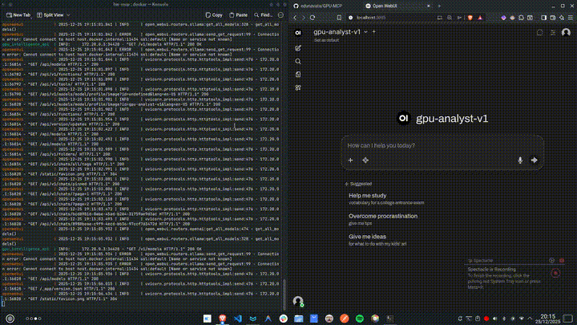

# GPU Intelligence MCP Chatbot

MCP (Model Context Protocol) **chatbot** that queries the database created in the `gpu-bd` POC and answers questions using either the OpenAI API or a local Ollama instance. It includes an agent server with SQLite access and an optional web UI via OpenWebUI.

POC database repository: https://github.com/edunavata/gpu-bd.git

## Demo

[](https://youtu.be/vERY0px_WYc)

> 💡 **Tip:** Haz clic en el GIF para ver el video completo en YouTube.
> 💡 [Ver demostración en YouTube](https://youtu.be/vERY0px_WYc)
## What this project is

- **MCP server** that exposes the POC database so the model can answer with real context.
- **OpenAI-compatible API** to integrate the chatbot with clients like OpenWebUI.
- **Docker-based stack** for fast, reproducible setup.

## Requirements

- Docker and Docker Compose
- Make
- Git
- An **OpenAI API key** (if you want OpenAI) or a **local Ollama** install

## Configuration

1) Copy or create the `.env` file with your provider settings:

```bash
DATABASE_URL="sqlite:///gpu-bd/db/pcbuilder.db"

# Provider selector: openai | ollama
LLM_PROVIDER=ollama

# Ollama (default)
OLLAMA_BASE_URL=http://localhost:11434/v1
OLLAMA_MODEL=llama3.1
OLLAMA_API_KEY=ollama

# OpenAI (optional)
OPENAI_API_KEY=sk-...
OPENAI_MODEL=gpt-4o
OPENAI_BASE_URL=
```

## Getting started

1) Clone this repo.
2) Run the setup to **clone the POC and create the database**:

```bash
make setup
```

3) Start the services:

```bash
docker compose up --build -d
```

Done. The stack is available at:

- **API MCP / OpenAI-compatible**: `http://localhost:8000/v1`
- **OpenWebUI**: `http://localhost:3005`

## How it works

- `make setup` clones `gpu-bd` and runs its initialization to create `gpu-bd/db/pcbuilder.db`.
- The `gpu-agent` container mounts the database as **read-only** and exposes an OpenAI-style API.
- `openwebui` connects to `gpu-agent` to interact with the chatbot in a web UI.

## Run with OpenAI or Ollama

Choose **one** provider and set the `.env` variables accordingly before running `docker compose up --build -d`.

### OpenAI

```bash
LLM_PROVIDER=openai
OPENAI_API_KEY=sk-...
OPENAI_MODEL=gpt-4o
```

### Ollama

```bash
LLM_PROVIDER=ollama
OLLAMA_BASE_URL=http://localhost:11434/v1
OLLAMA_MODEL=llama3.1
OLLAMA_API_KEY=ollama
```

## Structure

- `server/`: MCP API and database query logic
- `gpu-bd/`: POC repo checkout with the DB
- `docker-compose.yml`: services and container network
- `Makefile`: automates POC clone and init

## Basic usage

- Open OpenWebUI and ask about GPUs, builds, and components stored in the database.
- You can also consume the API from any OpenAI-compatible client.

## Quick troubleshooting

- If the DB does not exist, run `make setup` again.
- If you change the DB, restart containers: `docker compose down && docker compose up --build`.
